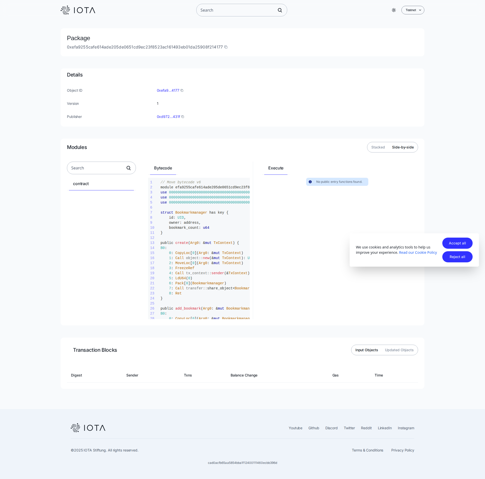

# 🔖 Bookmark Manager



## 📍 Contract Address

**Network**: Testnet  
**Package ID**: `0xefa9255cafe614ade205de0651cd9ec23f8523ac161493eb01da25908f214177`  
**Explorer**: [View on Explorer](https://explorer.iota.org/object/0xefa9255cafe614ade205de0651cd9ec23f8523ac161493eb01da25908f214177?network=testnet)
## 📋 Description

Bookmark Manager is a blockchain-powered dApp that allows users to manage their bookmarks in a decentralized way. Unlike traditional bookmark managers, your bookmarks are stored on the IOTA blockchain, giving you complete ownership and ensuring they're never lost or controlled by third parties.

**Smart Contract**: [View on IOTA Explorer](https://explorer.iota.org/object/0xefa9255cafe614ade205de0651cd9ec23f8523ac161493eb01da25908f214177?network=testnet)

## 🚀 Quick Start

```bash
# Install dependencies
npm install --legacy-peer-deps

# Deploy the smart contract
npm run iota-deploy

# Start development server
npm run dev
```

## 💡 How It Works

1. **Create Your Bookmark Manager**: Deploy the smart contract to create your personal bookmark manager on the IOTA blockchain
2. **Add Bookmarks**: Use the `add_bookmark()` function to store new bookmarks on-chain
3. **Manage Bookmarks**: Remove bookmarks using `remove_bookmark()` when needed
4. **Track Your Collection**: Query `get_bookmark_count()` to see how many bookmarks you've saved

The contract uses IOTA's shared object model, ensuring your bookmark data is:
- **Immutable**: Once stored, bookmarks are permanently recorded
- **Owned by You**: Only you can add or remove bookmarks
- **Transparent**: All operations are verifiable on the blockchain

## ✨ Features

- 🔐 **Decentralized Storage**: Bookmarks stored on IOTA blockchain, not on centralized servers
- 👤 **Full Ownership**: Complete control over your bookmark collection
- 🔒 **Secure**: Blockchain-level security for your data
- 📊 **Trackable**: Monitor your bookmark count and collection growth
- 🌐 **Cross-Platform**: Access your bookmarks from anywhere with your wallet
- ⚡ **Fast & Efficient**: Built on IOTA's high-performance blockchain
- 💰 **Low Cost**: Minimal transaction fees on IOTA network
- 🔍 **Transparent**: All operations are publicly verifiable

## 🛠️ Technical Stack

- **Frontend**: Next.js 16, React 19, TypeScript
- **Blockchain**: IOTA Smart Contracts (Move)
- **Wallet**: IOTA dApp Kit
- **UI**: Radix UI, Tailwind CSS
- **State Management**: TanStack Query

## 📚 Documentation

For detailed deployment and customization instructions, see **[INSTRUCTION_GUIDE.md](./INSTRUCTION_GUIDE.md)**

## 📁 Project Structure

```
├── app/                    # Next.js app directory
├── components/              # React components
├── hooks/                  # Custom React hooks
├── lib/                    # Configuration and utilities
├── contract/               # Move smart contracts
│   └── bookmarkmanager/
│       └── sources/
│           └── bookmarkmanager.move
└── public/                 # Static assets
```

## 🔗 Contract Functions

- `create()` - Initialize a new bookmark manager
- `add_bookmark()` - Add a new bookmark to your collection
- `remove_bookmark()` - Remove a bookmark from your collection
- `get_bookmark_count()` - Get the total number of bookmarks

## 🌐 Learn More

- [IOTA Documentation](https://wiki.iota.org/)
- [IOTA dApp Kit](https://github.com/iotaledger/dapp-kit)
- [Next.js Documentation](https://nextjs.org/docs)
- [Move Language](https://move-language.github.io/move/)

## 📄 License

MIT

---

Built with ❤️ on IOTA
